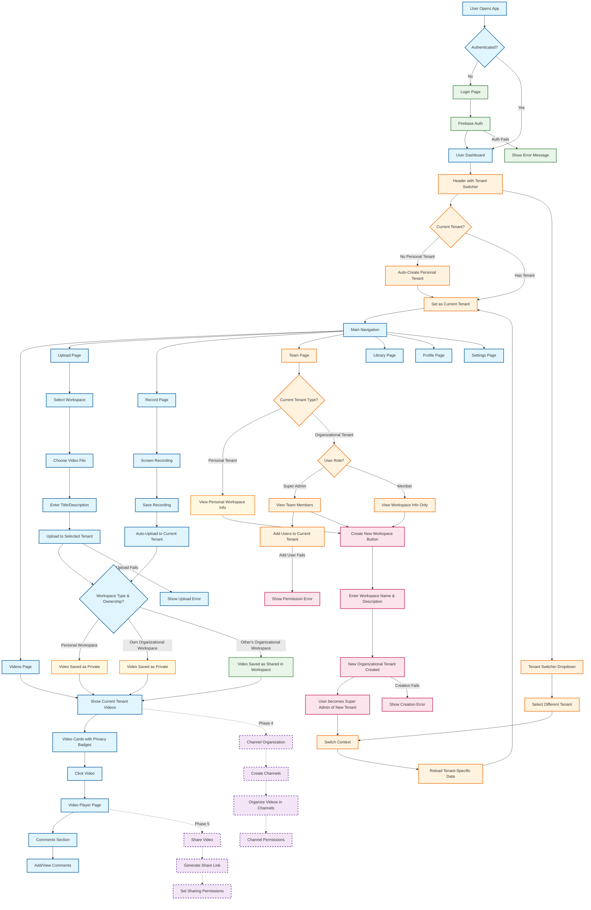

# User Flow Diagram

## Comprehensive User Flow - Current Implementation (Phases 1-3)

## Key User Journeys

### 1. **New User Journey:**
- Login → Auto-create personal tenant → Upload/record videos → Videos saved as private → Manage in personal workspace

### 2. **Workspace Creation Journey:**
- Any authenticated user can create new organizational workspaces
- Path: Team Page → Create New Workspace → Enter details → Become super admin of new workspace

### 3. **Team Collaboration Journey:**
- Super admin invites users → Users join organizational tenant → Upload videos → Videos shared in workspace → Role-based access control

### 4. **Video Privacy Logic:**
- **Personal Workspace**: Videos always private to user
- **Own Organizational Workspace**: Videos private to user (creator is super admin)
- **Other's Organizational Workspace**: Videos shared within workspace (accessible to all members)

### 5. **Video Management Journey:**
- Select workspace → Upload/record → Privacy determined by workspace type → View tenant-specific videos → Play with comments

## Legend:
- **Blue (Solid)**: Currently implemented features (Phases 1-3)
- **Purple (Dashed)**: Future planned features (Phases 4-10)
- **Green**: Authentication flows
- **Orange**: Tenant/workspace management flows
- **Pink**: Workspace creation flows (available to all users)
- **Yellow**: Personal workspace features
- **Light Green**: Shared workspace features

